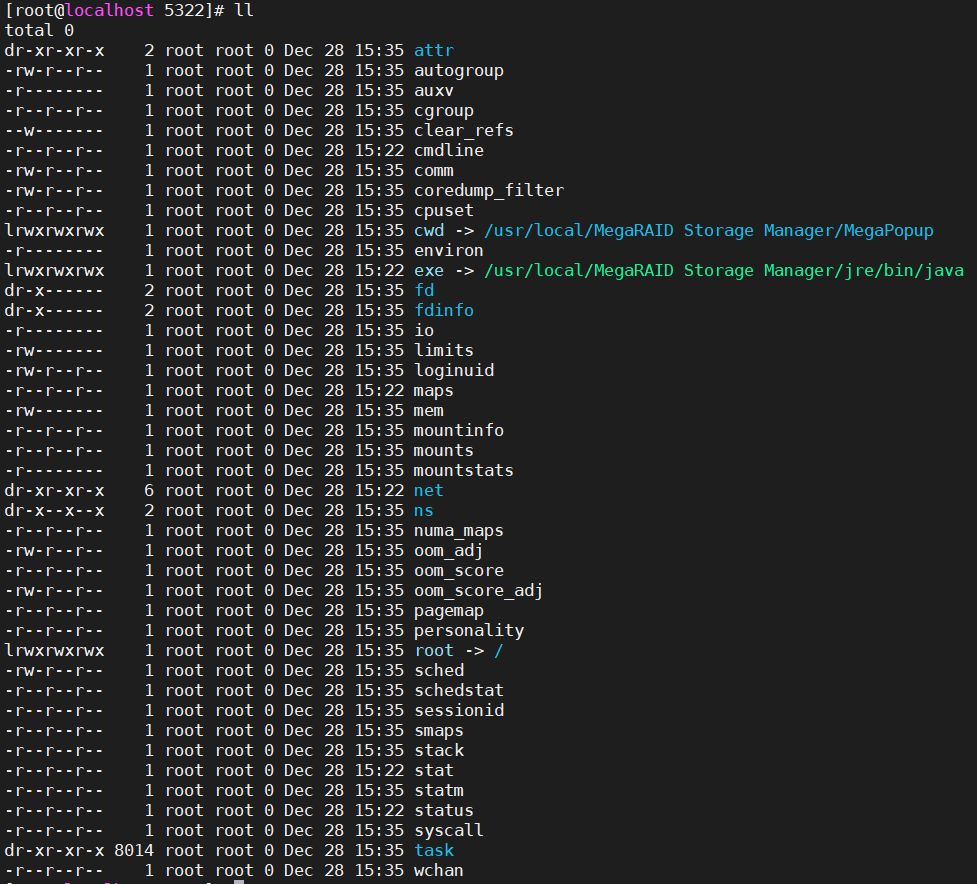
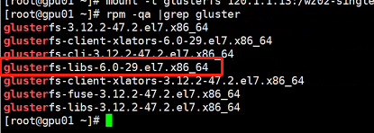
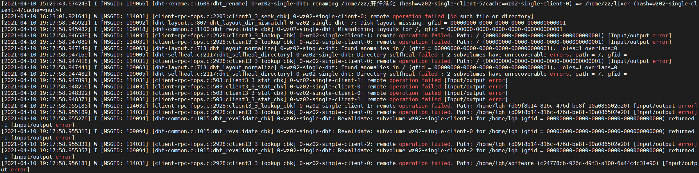

# 登录相关

## ssh无法登陆

1. 问题描述

    终端提示：`-bash: fork: Cannot allocate memory`，而后并不进入ssh终端，而是进入`-bash-4.1#`终端中，执行任何命令都提示`-bash: fork: Cannot allocate memory`。

2. 问题排查

    * 报错搜索

    针对`-bash: fork: Cannot allocate memory`报错，进行检索，在得到的[StackOverflow回答](https://stackoverflow.com/questions/43652021/bash-fork-cannot-allocate-memory)中定位到相应原因。

    * 原因分析

    Centos对进程数有上限限制（32768），亦即最多同时运行32768个进程，但是检查各个软件对应进程数后（检查代码：`ps -eo nlwp,pid,args --sort nlwp`）发现，存在单个程序占用了31948个进程的情况，亦即如下进程，根据PID将其结束掉之后，问题解决。
    `31948 5286 ../jre/bin/java -classpath .:Popup.jar:../GUI.jar Popup.Communicator ajsgyqkj=71244`

    查询该程序相关信息（`.:Popup.jar:../GUI.jar Popup.Communicator ajsgyqkj=71244`）后发现，该程序为MegaRaid的信息推送程序（经检查，其位于`/usr/local/MegaRAID Storage Manager`文件夹中），猜测可能是21号凌晨断电重启后，raid阵列出现了很多推送信息，但由于不处在图形化界面下，无法显示，因而进程数逐渐累加到达上限后，无法创建新的进程，导致ssh无法连接。

    终止该推送程序后，目前未发现该程序重启的情况，现已在图形化界面中将相应不必要的Raid管理程序卸载（后经重启确认，发现**卸载失败**，佛了），避免未来再发生类似的情况。

3. 后续情况

    * 2020.12.28 问题再次出现，重启后对应任务的进程数仍快速增加，检查pid对应任务信息如下
    

    * 解决方案

    1. 根据pid直接终止相应任务

    2. 修改该任务执行文件夹`/usr/local/MegaRAID Storage Manager`的文件名为`/usr/local/MegaRAID_Storage_Manager_bak`避免再次自启动——重启后**问题未出现（解决）**

    * 进一步排查

    1. 开机无法进入图形化管理界面原因（报错提示）

        * Starting ctdbd service \[FAILED\]

            问题未找到相应解决方案，ctdbd参考安装链接为[CentOS7下源码安装CTDB并尝试使用](https://blog.csdn.net/dandanfengyun/article/details/104971908)

        * :cbl runuser: user cbl does not exist

            问题可能在于VNC的配置信息上，将不应该再出现的`cbl`用户纳入进来，等待超哥解决- -已解决，将vnc启动相关设置关闭即可

# 存储相关

## 相应存储节点掉线

1. 2020.12.30

    1. 问题描述

        Jupyter Notebook掉线，且ssh进入gpu01节点时，提示`Could not chdir to home directory /home/lqh: No such file or directory`

    2. 问题排查

        * 原因分析

            * home文件夹所在的存储器掉线

                进入`/etc/rc.local`文件内，重新挂载上相应存储器，命令如下：

                ```
                mount -t glusterfs 120.1.1.11:/wz01 /public1
                mount -t glusterfs 120.1.1.13:wz02-single /public2
                mount -o bind /public2/home /home
                ```

                执行命令后，提示挂载失败，报错均为`/usr/sbin/glusterfs: symbol lookup error: /usr/sbin/glusterfs: undefined symbol: gf_latency_toggle`

                事实上，即使直接启动`glusterfsd -V`来检查软件状态，仍报错`glusterfsd: symbol lookup error: glusterfsd: undefined symbol: gf_latency_toggle`，因而定位问题应该在于glusterfsd客户端的启动问题（其他节点可正常挂载对应存储服务器）
            
            * 软件检查

                `rpm -qa | grep gluster`检查已安装的glusterf相关包，发现存在6.0和3.12版本共存的问题（glusterfs的客户端所有版本都必须一致才可以正常运行，正常的话客户端的gluster版本比服务端的高就可以，不能比服务端的低），`rpm -e 包名`卸载所有6.0版本相关包，重启后**仍未解决**

                

                以*可正常运行*为原则，根据其他节点中可正常运行的gluster相关软件包信息`rpm -qa | grep gluster`，下载4个对应的rpm包进行手动安装（存放于`/root/Downloads/glusterfs`），安装过程中提示需要编译安装`librocksdb`，但过于麻烦，暂不予理会，直接强制安装`rpm -Uvh *.rpm --nodeps`，**问题解决**

2. 2021.04.11

    1. 问题描述

        各个用户文件夹内文件(/home/xxx)均出现了不同程度的丢失情况，导致出现各种报错问题
    
    2. 问题排查

        * 原因分析

            * 进入glusterfs文件管理系统的日志目录`/var/log/glusterfs`检查相应日志信息，发现报错可总结为如下部分：

                
            
                核心报错如下所示：

                ```
                [2021-04-10 16:13:01.921641] W [MSGID: 114031] [client-rpc-fops.c:2203:client3_3_seek_cbk] 0-wz02-single-client-0: remote operation failed [No such file or directory]
                [2021-04-10 19:17:58.945921] I [MSGID: 109092] [dht-layout.c:807:dht_layout_dir_mismatch] 0-wz02-single-dht: /: Disk layout missing, gfid = 00000000-0000-0000-0000-000000000001
                [2021-04-10 19:17:58.945982] I [MSGID: 109018] [dht-common.c:1100:dht_revalidate_cbk] 0-wz02-single-dht: Mismatching layouts for /, gfid = 00000000-0000-0000-0000-000000000001
                [2021-04-10 19:17:58.946589] W [MSGID: 114031] [client-rpc-fops.c:2928:client3_3_lookup_cbk] 0-wz02-single-client-1: remote operation failed. Path: / (00000000-0000-0000-0000-000000000001) [Input/output error]
                [2021-04-10 19:17:58.947089] W [MSGID: 114031] [client-rpc-fops.c:2928:client3_3_lookup_cbk] 0-wz02-single-client-0: remote operation failed. Path: / (00000000-0000-0000-0000-000000000001) [Input/output error]
                [2021-04-10 19:17:58.947149] I [MSGID: 109063] [dht-layout.c:713:dht_layout_normalize] 0-wz02-single-dht: Found anomalies in / (gfid = 00000000-0000-0000-0000-000000000001). Holes=1 overlaps=0
                [2021-04-10 19:17:58.947169] W [MSGID: 109005] [dht-selfheal.c:2117:dht_selfheal_directory] 0-wz02-single-dht: Directory selfheal failed : 2 subvolumes have unrecoverable errors. path = /, gfid =
                [2021-04-10 19:17:58.947418] W [MSGID: 114031] [client-rpc-fops.c:2928:client3_3_lookup_cbk] 0-wz02-single-client-0: remote operation failed. Path: / (00000000-0000-0000-0000-000000000001) [Input/output error]
                [2021-04-10 19:17:58.947441] I [MSGID: 109063] [dht-layout.c:713:dht_layout_normalize] 0-wz02-single-dht: Found anomalies in / (gfid = 00000000-0000-0000-0000-000000000001). Holes=1 overlaps=0
                [2021-04-10 19:17:58.947482] W [MSGID: 109005] [dht-selfheal.c:2117:dht_selfheal_directory] 0-wz02-single-dht: Directory selfheal failed : 2 subvolumes have unrecoverable errors. path = /, gfid =
                [2021-04-10 19:17:58.947891] W [MSGID: 114031] [client-rpc-fops.c:503:client3_3_stat_cbk] 0-wz02-single-client-1: remote operation failed [Input/output error]
                [2021-04-10 19:17:58.948216] W [MSGID: 114031] [client-rpc-fops.c:503:client3_3_stat_cbk] 0-wz02-single-client-0: remote operation failed [Input/output error]
                ```

# 软件相关

## JupyterHub相关问题

1. 2019.9.30：tornado包出现问题，版本过高导致jupyter无法正常运行，指定版本为4.5.3后正常运行`pip install tornado==4.5.3`

2. 2019.10.27（解决时间：4h）：由于希望能够重装nvidia驱动，重启系统，发现jupyterhub崩了
	
    * 运行jupyterhub -h后，报错ImportError: cannot import name 'secure_write'：运行pip install --upgrade jupyter_client后解决，来自
	
    * 继续尝试运行jupyterhub，可以进入用户界面，似乎可以了，但此时进入ipynb文件后，发现无法创建kernel，界面内报错为`traitlets.traitlets.TraitError: The 'loop' trait of an IOLoopKernelManager instance must be a ZMQIOLoop traitlets.traitlets.TraitError: The 'loop' trait of an IOLoopKernelManager instance must be a ZMQIOLoop`，经过查询
        
        * 结果一，大部分人认为是Tornado的版本问题，Tornado太新（>5.0）而jupyter版本过旧，于是运行pip install "tornado<5.0"，将tornado降级至4.5.3版本，未解决，甚至出现新问题
		
        * 直接无法进入用户的文件页面，而是在spawn页面直接停了，命令行提示信息为`jupyterhub ERROR:asyncio:Task exception was never retrieved`，这里经过查询发现，是tornado版本太低了导致创建出错
		
        * Tornado版本太高也不行，太低也不行，这里有两种思路解决
			
            * tornado版本降低的话，相应的jupyter依赖包也要进行降级以满足其需求，此处我们可以找到github上的人贴出来的解决成功后的案例一、案例二python包安装版本，根据他们的成功案例依次安装对应版本的包(此处并不行，可能是由于其他包都太新了)

    * tornado版本太低连进去都无法进去，所以这里还是不考虑降级tornado，而是保留最新版本的tornado，从其他方面解决，这里我们选择更新notebook，之前没注意到的是，由于tornado版本冲突，jupyter 5.7.5版本以下并不支持tornado6.0，但jupyter notebook 5.7.5版本已经修复该bug，于是升级jupyter notebook到5.7.5以上，运行 `pip install jupyter notebook==5.7.5`，问题解决

3. 2020.12.30：gpu服务器的存储系统突然出现问题（挂载失败），修复完成后jupyterhub无法启动

    * 重新应用pip安装jupyterhub，但是提示`Fatal Python error: initsite: Failed to import the site module `，就很迷惑，甚至还一度出现了pip无法安装包，报错`ModuleNotFoundError: No module named 'pip._internal' with python source code installation`的插曲（修复方式：[StackOverflow链接](https://stackoverflow.com/questions/56361133/how-to-fix-modulenotfounderror-no-module-named-pip-internal-with-python-sour)）

    * 再尝试应用conda安装jupyterhub（因其可自动选择最合适的依赖项），结果发现启动不了？？经检查才发现是pip安装的jupyterhub未卸载，完全卸载conda、pip版本再安装后即可

    * 最后运行jupyterhub时，提示无法打开单人的notebook，此时应采取的策略为——**根据报错相关提示直接在本人终端下运行相应出错的py文件，得到详细报错后再进行解决**（附注，解决完成后应重启root终端，避免重复报错的问题）